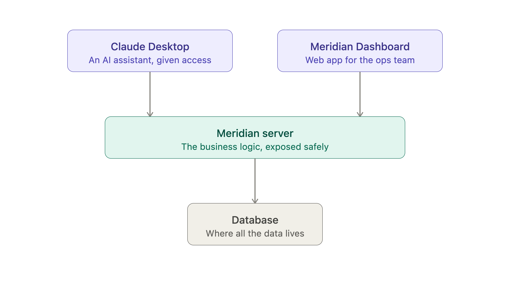

# Architecture



## Overview

Meridian's internal systems (accounts, support tickets, product usage,
incidents) are exposed as MCP tools over a remote HTTP/SSE server, so any
MCP client (Claude Desktop, claude.ai, a custom agent) can query and act on
them through a single, authenticated, scope-controlled interface.

```
[Claude Desktop / Agent] --HTTP/SSE--> [Meridian MCP Server] --Prisma--> [Postgres]
                                              |
                                     [Meridian Dashboard]
                                     (Next.js, read-only)
```

## Key design decisions

- **Composite tools over raw CRUD:** `get_account_360` joins four data
  sources server-side instead of leaving the model to make and reconcile
  four separate calls.
- **Server-enforced state machine:** ticket status transitions are
  validated in the server, not left to agent discipline.
- **Scoped API keys:** every tool call carries a scope; write operations
  require a distinct scope from reads.
- **Structured error codes:** `VALIDATION_ERROR`, `NOT_FOUND`,
  `FORBIDDEN_SCOPE`, `CONFLICT`, `INTERNAL_ERROR`, not generic failures.

## Demo chain — sequence diagram

The live demo chain (see `docs/demo-script.md`): a single natural-language
prompt to Claude Desktop triggers `list_active_incidents` to find the
current incident, `check_incident_impact` to pull affected accounts and
MRR exposure, then `get_account_360` per Enterprise account to build a
sorted escalation draft — all through the same authenticated MCP server.


## Scope model — class diagram

`claude-agent-prod` and `dashboard-readonly` authenticate against the same
server but carry different scopes: only `claude-agent-prod` can write
tickets or read the audit log, so `get_audit_log` and any write tool are
unreachable from the dashboard by construction, not by convention.


## Dashboard

The dashboard (`meridian-dashboard`, sibling repo, deployed separately to
Vercel) is a read-only Next.js app over this server's `/mcp` endpoint,
with no code dependency on this repo: just an HTTP client against the
deployed tool set.

**Screens and their tool calls** (all Server Components, no client-side
JS, no intermediate `/api` proxy: each screen calls the MCP server
directly through a server-only client wrapper):

- **Renewal Risk** (`/renewal-risk`): `get_renewal_risk`
- **Incidents** (`/incidents`, `/incidents/[id]`): `list_active_incidents`,
  `check_incident_impact`
- **Tickets** (`/tickets`): `search_tickets`, filtered via URL search
  params
- **Account drill-down** (`/accounts/[id]`): `get_account_360`

Every screen authenticates with the `dashboard-readonly` key
(`read:accounts`, `read:tickets`, `read:incidents`, no `admin` and no
write scopes), so `get_audit_log` and any write tool are permanently out
of reach from the dashboard by design, not by oversight.

### Chat: scoped out

A chat feature (the dashboard as its own MCP client running an agent
loop: calling an LLM with this server's tools attached, executing tool
calls, looping to a final answer) was in the original plan but has been
deliberately scoped out for now. Reasoning:

- The project's actual "moment that sells it" (see `docs/demo-script.md`),
  one natural-language line triggering a chained, cross-system tool call
  sequence, is already proven live, using Claude Desktop as the MCP
  client against this deployed server. Chat in the dashboard would not
  unlock a new capability; any MCP-compliant client can already do this,
  and one already does.
- It would have added a second, largely separate skill demonstration
  (agent-loop/MCP-client engineering) on top of a portfolio that already
  demonstrates the core FDE/SE signal end to end: tool design,
  auth/scopes, state-machine enforcement, transactional audit logging, a
  tested integration suite, live deployment, and a documented delivery
  process.
- It was also the single largest, riskiest remaining scope item across
  both repos: a new client-side UI, a new `/api` route, a hand-rolled or
  SDK-driven agent loop, a new LLM API key to manage, and a new
  verification bar (multi-turn state, streaming, non-deterministic tool
  selection) that does not fit the "hand-check output against raw JSON"
  model every other screen uses.
- The dashboard's read-only scope is not a limitation being apologized
  for here: it is an intentional design decision. This is an
  ops-visibility tool; the write-capable "agent that can act" story is
  already told elsewhere, live, in Claude Desktop with write scope.

**Future addition, not committed work:** a minimal single-shot Q&A
widget (one question, one answer, no persisted multi-turn conversation
state, no streaming), using the Claude Agent SDK to wire this deployed
MCP server in as a remote tool source rather than hand-rolling a
tool-call loop. Meaningfully smaller than a full chat feature; flagged
here as a possible future addition only.

## Deployment

The MCP server deploys to **Render** as a Docker-runtime web service on
the free tier, provisioned declaratively via the `render.yaml`
Blueprint at the repo root, alongside a free Render Postgres instance.
Schema migrations run automatically on container boot (`prisma migrate
deploy` is part of the Dockerfile `CMD`), since the free tier has no
Shell access to run them after the fact. A `GET /health` endpoint
exists solely for Render's health check and carries no business logic.

Originally planned for Fly.io; switched to Render because Fly's free
tier is a short (2hr/7-day) trial requiring a card afterward, while
Render's free web service and Postgres need none. The dashboard deploys
to Vercel (a separate repo, unaffected by this choice).

## Notes

- **Note:** invalid-enum input (e.g. an unrecognized `new_status` value)
  is rejected by the MCP SDK's own schema validation before the tool
  handler runs; it never reaches `mapErrorToToolResult()`. Business-logic
  errors (`CONFLICT`, `NOT_FOUND`, `FORBIDDEN_SCOPE`) are caught and mapped
  by our own code; schema-shape errors are caught one layer earlier, by
  the SDK itself.
